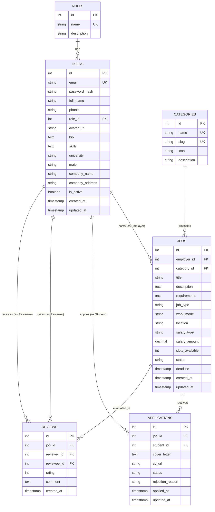

# SƠ ĐỒ THIẾT KẾ CƠ SỞ DỮ LIỆU (ERD DIAGRAM)

**Dự án:** Nền tảng quản lý freelance / marketplace việc làm part-time cho sinh viên  
**Học phần:** Chuyên đề tốt nghiệp 2 — Nhóm 8  

---

## 1. SƠ ĐỒ THỰC THỂ QUAN HỆ (MERMAID ERD)

---

## 2. QUY TẮC RÀNG BUỘC VÀ TÍNH TOÀN VẸN
1. **Ràng buộc ứng tuyển duy nhất (Constraint `unique_job_student_application`):** Một sinh viên chỉ được tạo tối đa 1 hồ sơ ứng tuyển vào 1 tin tuyển dụng nhất định (`UNIQUE (job_id, student_id)`).
2. **Ràng buộc đánh giá 1 lần (Constraint `unique_job_reviewer`):** Mỗi người tham gia chỉ được đánh giá 1 lần cho 1 công việc cụ thể (`UNIQUE (job_id, reviewer_id)`).
3. **Thang điểm hợp lệ:** Điểm đánh giá bắt buộc nằm trong khoảng từ 1 đến 5 sao (`CHECK (rating >= 1 AND rating <= 5)`).
4. **Vòng đời trạng thái công việc (Job State Machine):**
   `OPEN` (Đang tuyển sinh viên) ➔ `IN_PROGRESS` (Đã duyệt ứng viên và đang tiến hành) ➔ `COMPLETED` (Đã hoàn thành bàn giao) ➔ `CLOSED` (Đã đóng).
