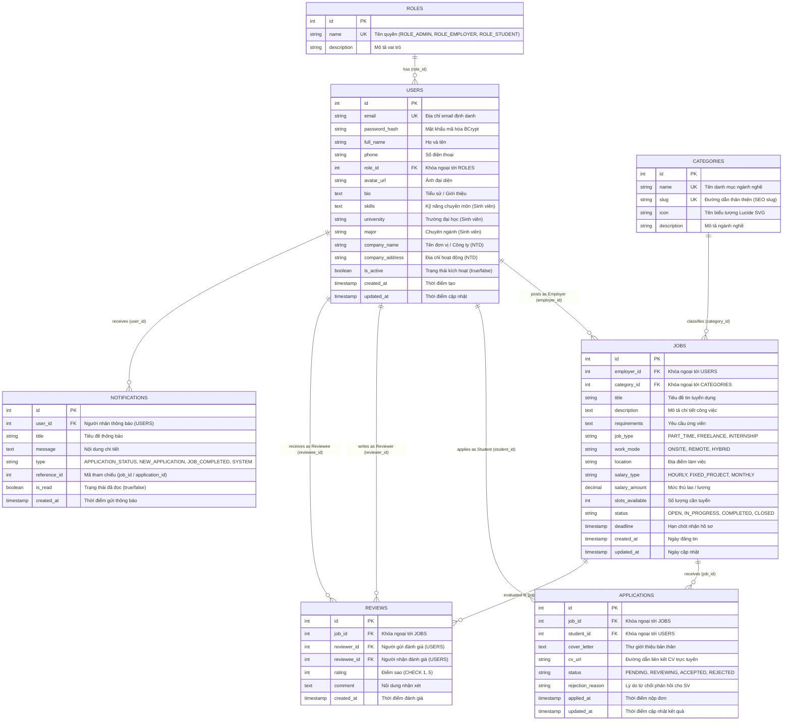

# SƠ ĐỒ THIẾT KẾ CƠ SỞ DỮ LIỆU (DATABASE ERD DIAGRAM)

**Dự án:** Nền tảng quản lý freelance & marketplace việc làm part-time cho sinh viên  
**Học phần:** Chuyên đề tốt nghiệp 2 — Nhóm 8 (261_71ITGR40303_04)  
**Hệ quản trị CSDL:** PostgreSQL 16 (Chuẩn 3NF, ACID Compliant)  
**Phiên bản:** v1.2  

---

## 1. SƠ ĐỒ THỰC THỂ QUAN HỆ (MERMAID ERD)

---

## 2. QUY TẮC RÀNG BUỘC VÀ TÍNH TOÀN VẸN (INTEGRITY CONSTRAINTS)

1. **Ràng buộc Chống nộp trùng đơn (`unique_job_student_application`):**
   - Mỗi sinh viên chỉ được tạo tối đa 1 hồ sơ ứng tuyển vào 1 tin việc làm nhất định:
     `UNIQUE (job_id, student_id)`
2. **Ràng buộc Đánh giá một lần (`unique_job_reviewer`):**
   - Mỗi người dùng chỉ được gửi tối đa 1 đánh giá cho 1 công việc cụ thể:
     `UNIQUE (job_id, reviewer_id)`
3. **Kiểm tra thang điểm hợp lệ:**
   - Điểm đánh giá bắt buộc phải nằm trong thang 1 đến 5 sao:
     `CHECK (rating >= 1 AND rating <= 5)`
4. **Vòng đời trạng thái việc làm (Job State Machine):**
   - `OPEN` (Đang nhận đơn) ➔ `IN_PROGRESS` (Đã duyệt ứng viên, đang làm) ➔ `COMPLETED` (Đã hoàn thành bàn giao) ➔ `CLOSED` (Đóng tin).
5. **Hệ thống Chỉ mục hiệu năng (13 B-Tree Indexes):**
   - Đánh chỉ mục trên: `users(email)`, `users(role_id)`, `jobs(category_id)`, `jobs(employer_id)`, `jobs(status)`, `jobs(job_type)`, `jobs(work_mode)`, `jobs(created_at DESC)`, `applications(job_id)`, `applications(student_id)`, `applications(status)`, `reviews(job_id)`, `notifications(user_id, is_read)`.
